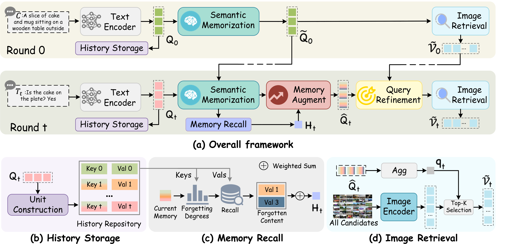

# Memory-Augmented Query Intent Understanding for Efficient Chat-based Image Retrieval



## Datasets
Download the extracted features from [Google drive](https://drive.google.com/drive/folders/1IIuN9_xcFm-ik2xeZVjpPvZK-cHu7U4q?usp=sharing) and place the data in the file images.

```
- VisDial
  ├── images
      ├── corpus_blip.pth
      └── visdial_img_train.pth
      └── visdial_img_val.pth
```


## Environments

- **Ubuntu** 20.04  
- **CUDA** 12.6  
- **Python** 3.10  

Use the following instructions to create the corresponding conda environment.  
Please make sure to download the required pretrained models (e.g., BLIP) from their official sources before running the training or evaluation scripts.

```
conda create --name maqiu python=3.10 -y
conda activate maqiu
pip install -r requirements.txt
```
## Training and Evaluation

### Run the following script for multi-GPU finetuning on VisDial:

```
./train.sh $run_id
```

**Argument meaning**

- `$run_id` — folder name for saving checkpoints and logs


**Example**

```
./train.sh run_0
```

### Run the following script for evaluation:

```
./eval.sh $run_id
```

**Example**

```
./eval.sh run_0
```


